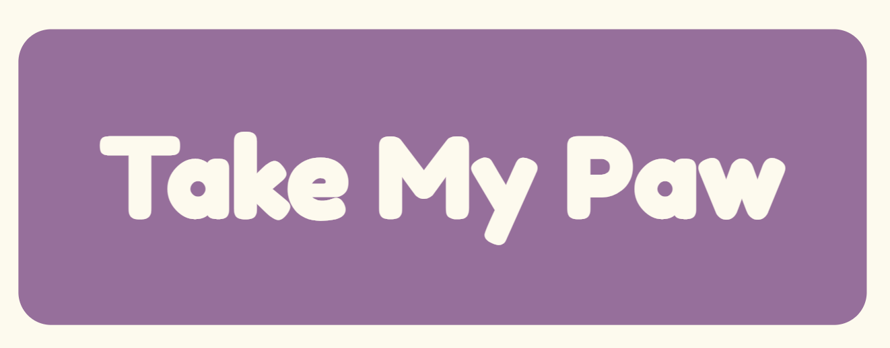

# HELLO KITTIES SERVER

This is the server for our app Take My Paw

## Installation
- If you don't have **Node** installed you can install it from [here](https://nodejs.org/en/download/current/), make sure to install the current version 
- Clone the repo and **cd** into it
- Now, **cd** into the folder `server/server` and run `npm install -D` to install all required packages

## Development
 - You can start the server by running `npm run dev` within the `server/server` folder, it will refresh automatically while changes are made on **app.js**

 ## Production
- Move into the `server/server` folder and run `npm run start` to make the server start listening
